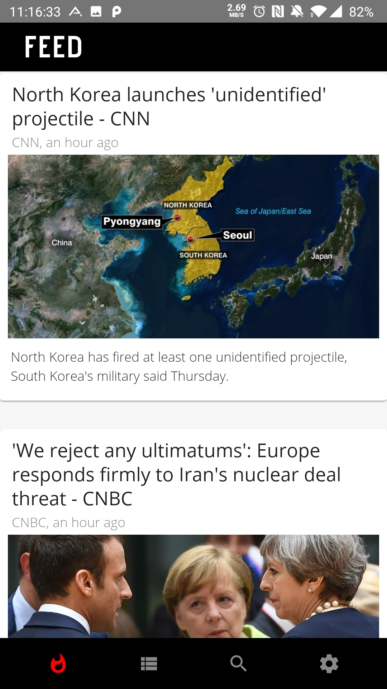

    

# Newsider 

**Newsider** - mobile app for Android that lets users choose the news that they want to see. Users choose the categories and decide what’s going to be in their news feed. Newsider uses the [News API](https://newsapi.org/) to provide end-users with the highest quality information based on selected news categories.

## Project structure

- [`App/Components`](App/Components): presentational components
- [`App/Containers`](App/Containers): container components, i.e. the application's screens
- [`App/Images`](App/Images): images used by the application
- [`App/Navigators`](App/Navigators): react navigation navigators 
- [`App/Services`](App/Services): application services, e.g. API clients
- [`App/Stores`](App/Store): redux [actions, reducers, sagas and store]
- [`App/Theme`](App/Theme): base styles for the application

For more information on each directory, click the link and read the directory's README.

## Running project locally

- clone this repository
- `yarn install` or `npm intall` to install project dependencies
- run project using `react-native run-[android/ios]`

## Example screenshots

    
    

## Incoming improvements
- Making screens transition smoother,
- Shortening of article title by removing source, which is shown above the article image,
- Implementation of empty screens

## Used libraries
* [React Native Boilerplate](https://github.com/thecodingmachine/react-native-boilerplate) - Boilerplate
* [React Native Paper](https://github.com/callstack/react-native-paper) - UI Library
* [Redux](https://github.com/reduxjs/redux), [Redux Saga](https://github.com/redux-saga/redux-saga), [Redux Persist](https://github.com/rt2zz/redux-persist) - State management
* [axios](https://github.com/axios/axios) - HTTP Client
* [Jest]() - Testing
 
## Authors
Michał Żuk • michalzuk33@gmail.com

## License
Project based on • [MIT License](LICENSE.md)
